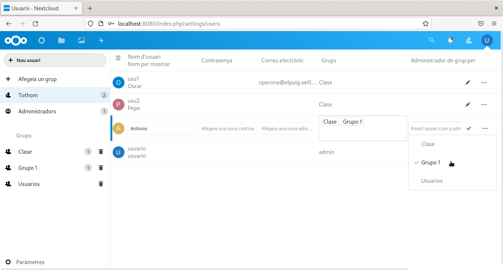

# Configuracion de nextcloud

Aqui vamos a hacer la configuracion de nextcloud, para ello previamente lo habremos instalado.

Priero iniciamos sesion en nextcloud, commo habiamos dicho antes entramos en `localhost:8080` y aparece la ventana de inicio de sesion.

### Creacion de grupos.

Para la creacion de grupos nos dirigimos a la zona superior izquierda, se nos abre un desplegable y ahi haceos click en usuarios.

Ahora en la zona iaquierda aparece un partaddo para añadir grupos, le damos en esa parte y agregamos el nombre que deseamos.

### Creacion de usuarios

Ahora vamos otra vez en usuarios y en el desplegable hacemos click usuarios.

Y luego en nuevo usuario.

### Agregar usuarios a un grupo

Para agregar usuarios y grupos vamoos a la parte de todos y aqui nos saldra unna lista con el usuario, le damos click y lo asignamoos donde queramos.

### Como hacer a un usuario administrador de un grupo

En la gestion de usuarios y grupos donde pone todos y saldra unas opciones y led damos asignar usuario como administrador.

### Crear carpetas y subir archivos

Para subir un archivo nos vamos a la parte de gestion de ficheros o archivos, le damos en ficheros.

Para crear una carpeta pulsamos el boton `+` y Crear Carpeta.

Para subir un fichero hacemos click de nuevo y subir archivo.
