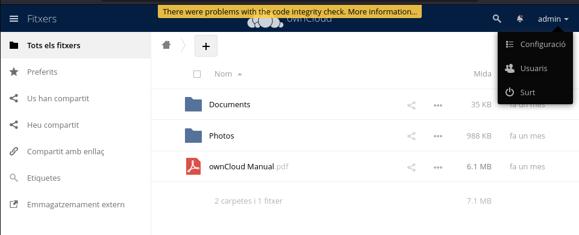
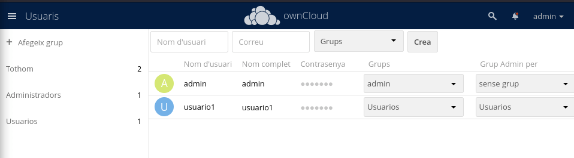
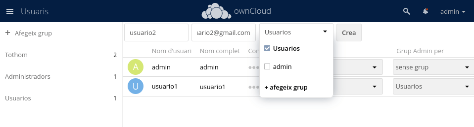
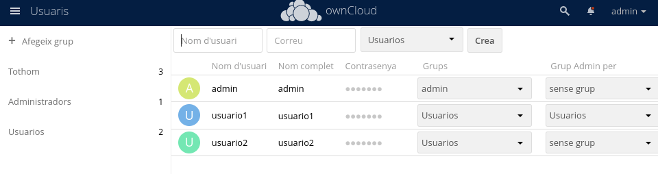
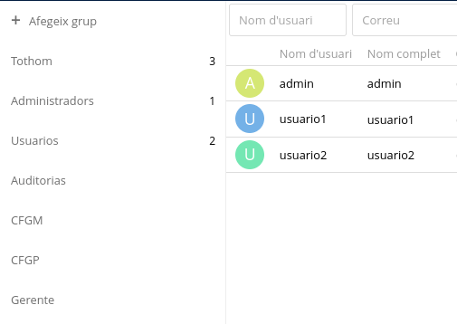
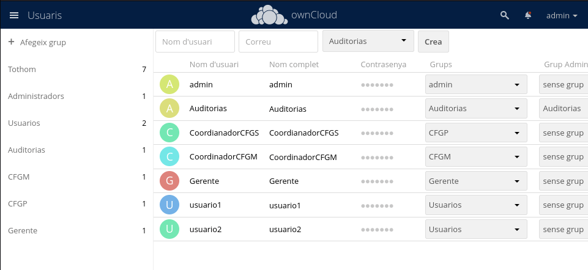
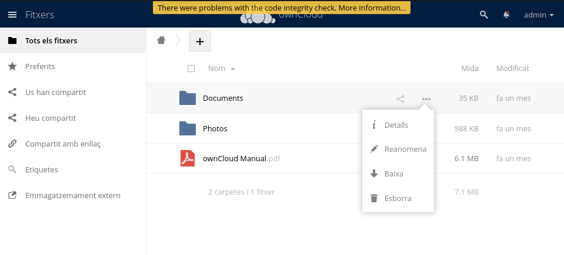
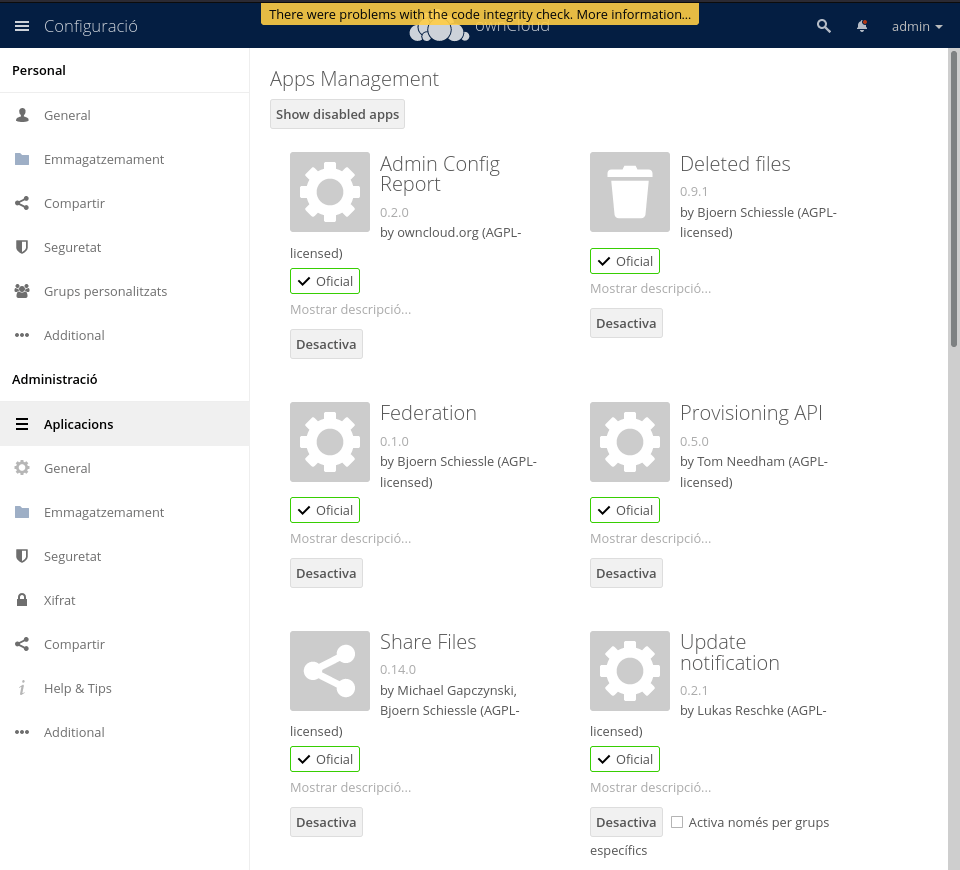

# Ahora vamos a hacer la configuracion de Owncloud.

### Lo primero que vamos a ver es la creacion de usuarios y grupos.
  

  Como podemos ver se desplega una barra, presionamos usuarios para entrar en los ajustes de los usuarios y poder personalizar.

  En esta imagen vemos el apartado de los usuarios y creacion de grupos

Aqui vemos como podemos agregar usuarios añadiendo un usuario y correo y en un grupo.

Una vez hecho podemos ver los usuarios ya creados.

Aqui podemos ver los grupos creados y para añadir uno es tan sencillo como darle a añadir grupo.

### Asignacion de Roles

Como vemos una vez creado los roles o grupos añadimos cada uno en su correspondiente como podemos visualizar en la foto.

### Administracion de archivos

Aqui vemos como se pude subir, bajar, eliminar y administar archivos.

### Configuracion De Aplicaciones

Aqui observamos que podemos añadir diversas apps para dar mas funcionalidad al servidor
